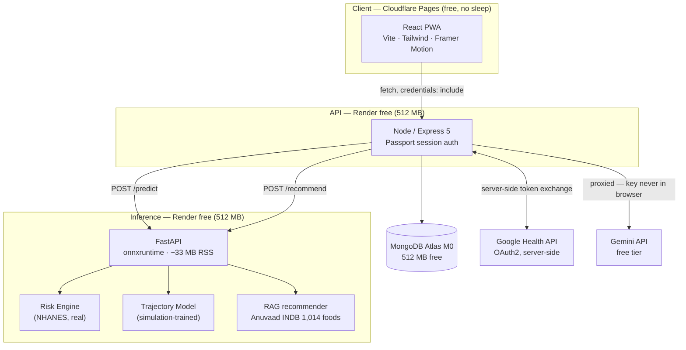
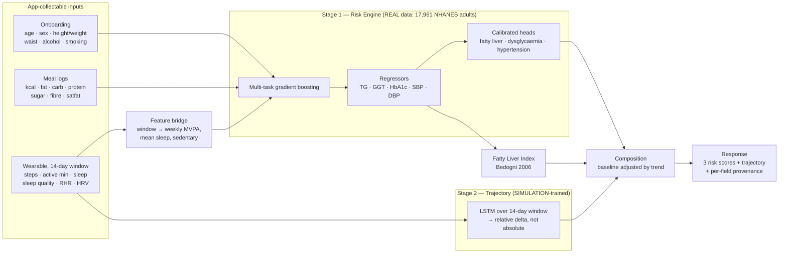

# Niyantrana — Architecture

> The system as built: what each service does, what the model is trained on, and
> the constraints that shaped both.

---

## 1. Choosing a target the data can supervise

The obvious formulation of this problem is **14 days of wearable data → today's
blood biomarkers**. It is also unlearnable, and the obstacle is measurement
rather than modelling: nobody draws blood daily, so no dataset exists in which
that mapping is observed.

We established this by building it. Trained on generated daily data for 15
personas, the model reported **R² 0.900** for triglycerides and **0.974** for
GGT. Both figures were artefacts of how the data was split — scalers fitted
before splitting, and a random split over 14-day windows that overlap by 13 of
14 days, so the same person lands on both sides with near-duplicate rows. Split
by participant instead, the same model scores **R² −0.89 / −0.87: worse than
predicting the mean.** At the person level, 15 personas is nine training
examples, and no architecture recovers from that.

**The feature bridge is the answer to it.**

NHANES measures self-reported **sleep duration** (`SLD012`) and **weekly
activity minutes** (`PAQ`). A wearable measures the same two quantities with a
better instrument. So rather than forcing raw wearable sequences into a model no
real data can train, the system **derives NHANES-comparable features from the
wearable window** and trains the core model on 17,961 real adults.

The wearable stops being the thing the model cannot learn from and becomes the
thing that keeps those features current — daily, without a clinic visit.

---

## 2. System topology



**Three deployed services, not four.** The RAG recommender lives inside the
inference service rather than alongside it: free-tier instance-hours are shared
per workspace, and it already needs the same food database loaded in the same
process.

**Why onnxruntime and not TensorFlow:** measured on this machine, importing
TensorFlow costs **358 MB RSS**; onnxruntime costs **33 MB**. Render's free tier
caps at 512 MB. Training stays in Keras offline; only the exported ONNX graph
ships. Parity verified at 5.9e-08.

---

## 3. ML architecture



### Stage 1 — Risk Engine (the scientific core)

Trained on **real NHANES data**, using only features the app can actually
supply. A feature the app cannot collect is a feature that will be missing at
serving time, so it is not in the training set either.

| Group | Features |
|---|---|
| Profile | `age`, `sex_male`, `bmi`, `waist_cm` |
| Diet (24h) | `energy_kcal`, `fat_g`, `carb_g`, `protein_g`, `sugar_g`, `fibre_g`, `satfat_g` |
| Wearable-derived | `sleep_hours`, `mvpa_min_week`, `vigorous_min_week`, `moderate_min_week`, `sedentary_min_day` |
| Lifestyle | `alcohol_drinks_week`, `smoking_status` |

Alcohol is in that list because it is a **major GGT confounder**, and GGT feeds
the fatty-liver estimate: omitting it biases that score.

**Model:** `HistGradientBoostingRegressor` (scikit-learn). Chosen over
XGBoost/LightGBM because it handles NaN natively — essential for NHANES, where
every column has real missingness, and equally essential at serving time, where
a user may simply not own a heart-rate sensor. It also adds **zero deployment
dependencies** beyond the scikit-learn already needed for the scalers.

**Targets and availability** (from the ingested 17,961 adults):

| Target | n | Feeds |
|---|---|---|
| `ggt` | 16,155 | FLI |
| `hba1c` | 16,392 | Diabetes head |
| `systolic_bp` / `diastolic_bp` | 16,536 / 16,416 | Hypertension head |
| `triglycerides` | 7,543 | FLI (fasting subsample) |
| `fli` (derived) | 7,155 | Fatty liver head |

**Derived risk heads:**
- Fatty liver — FLI ≥ 60 (Bedogni)
- Dysglycaemia — HbA1c ≥ 5.7 (pre) / ≥ 6.5 (diabetic)
- Hypertension — ≥ 130/80

Three conditions from one feature set, because they share one underlying
metabolic process: ~60% of people with diabetes also have hypertension, and
over 70% also have fatty liver. Modelling them jointly is how the screening
matches the clustering.

### Stage 2 — Trajectory model

The LSTM reads the 14-day window and predicts a **relative trend** on top of the
Stage 1 baseline rather than an absolute biomarker value — the absolute version
is the unsupervisable target from section 1. Every response it touches is tagged
`simulation-trained` until real longitudinal data is secured, because that is
what it is.

### Stage 3 — Risk trajectory

Run the Risk Engine over rolling windows of the user's own history → a risk time
series → fit a trend → extrapolate. This produces early warning from defensible
inputs alone, with no pretence of daily blood draws.

---

## 4. The provenance contract

The single most important rule in this codebase:

> **Never emit a number without saying where it came from.**

Every risk value in every API response carries a `source`:

| `source` | Meaning |
|---|---|
| `model` | Real prediction from the NHANES-trained Risk Engine |
| `simulation` | Involves the simulation-trained trajectory model |
| `heuristic` | Rule-based (e.g. FLI computed directly from user-entered labs) |
| `unavailable` | Inference failed — **an error, never a substituted value** |

The rule exists because the moment a substitute is most tempting is the moment
it is most harmful. A model timeout, a history too short to score, a biomarker
the user never had measured — each is a point where returning a plausible number
is easy and silently wrong, and where the user has no way to tell. So the
absence is reported instead, and the UI says which of the four it is.

`unavailable` is a 503, not a 200 with a filled-in field. The contract is
enforced by construction: `Provenance` is a required argument on the score value
object, so no code path can return a number without one.

The UI surfaces the badge alongside a standing medical disclaimer: advisory
only, not a diagnostic device, confirm with clinical tests.

---

## 5. Request flow

```
POST /api/predict   (session cookie)
  │
  ├─ Load user profile + last 14 days of watchHistory from Mongo
  ├─ Aggregate meal logs → daily macro totals
  ├─ Feature bridge: window → weekly MVPA, mean sleep, sedentary
  │
  ├─ POST → inference service /predict
  │     ├─ Risk Engine  → TG, GGT, HbA1c, SBP, DBP → FLI → 3 calibrated risks
  │     └─ Trajectory   → trend delta  [tagged: simulation]
  │
  ├─ On failure → 503 with source:"unavailable"   ← never a fabricated number
  │
  └─ 200 { risks: {...}, trajectory: [...], source: "model", disclaimer: "..." }
```

---

## 6. Security posture

The data here is health data attached to a named account, so the defaults are
set for that: secrets stay on the server, sessions are required, and nothing
sensitive is stored where the browser can read it.

| Concern | How it is handled |
|---|---|
| Gemini API key | Server-side only. The chat and recommendation endpoints proxy it, so it never enters the bundle |
| OAuth client secret | Server-side authorization-code exchange; the browser only ever sees the consent redirect |
| Secrets in logs | Nothing that reads as a credential is printed at boot or in request logs |
| Session secret | A required environment variable. Boot fails without it rather than falling back to a default that would be identical across every deployment |
| Cookies | `secure: true`, `sameSite: none`, behind `trust proxy` — the client and API are on different origins, so anything less does not survive the round trip |
| Health data | Server-side and per-user isolated. `localStorage` holds UI preferences only |
| Inference service | FastAPI with no debug server, and no interactive console reachable from outside |
| Account deletion | A single authenticated call removes the profile, history, reports and session — no support ticket, no retention window |

---

## 7. Deployment

| Layer | Platform | Free-tier reality (Sept 2026) |
|---|---|---|
| Frontend | Cloudflare Pages | Free, global CDN, **no sleep** |
| Node API | Render free web service | 512 MB / 0.1 CPU, sleeps after 15 min, ~1 min cold start |
| Inference | Render free web service | Same; fits only because TF stays out of the serving path |
| Database | MongoDB Atlas M0 | 512 MB, free forever, no card |
| LLM | Gemini API free tier | ~10 RPM on 2.5 Flash |

Total cost: **₹0/month.** Cold start is the one real cost, and the client
absorbs it: the landing and sign-in pages wake both services while the visitor
reads, and the dashboard retries around a container that is still booting.

Upgrade path: the GitHub Student Developer Pack (DigitalOcean $200, Azure $100)
buys always-on hosting if the cold start becomes tiresome.

---

## 8. Known limitations (state these openly)

1. **NHANES is a US population.** Metabolic thresholds differ for South Asians — Indian cohorts show higher risk at lower BMI. Recalibrating against NFHS-5 or LASI is the largest single improvement available; until then the model is US-calibrated and says so, in the UI and in the API response.
2. **Triglycerides come from the fasting subsample** (7,543 of 17,961), so the FLI head trains on less data than the GGT/HbA1c/BP heads.
3. **The trajectory is a trajectory of estimates.** It scores successive windows of a person's own history with a model fitted across people, because no open dataset pairs longitudinal wearable data with repeated biomarker draws at usable scale.
4. **NHANES diet is a single 24-hour recall**, which is noisy — it captures one day, not habitual intake.
5. **This is not a medical device.** Screening and education only.
